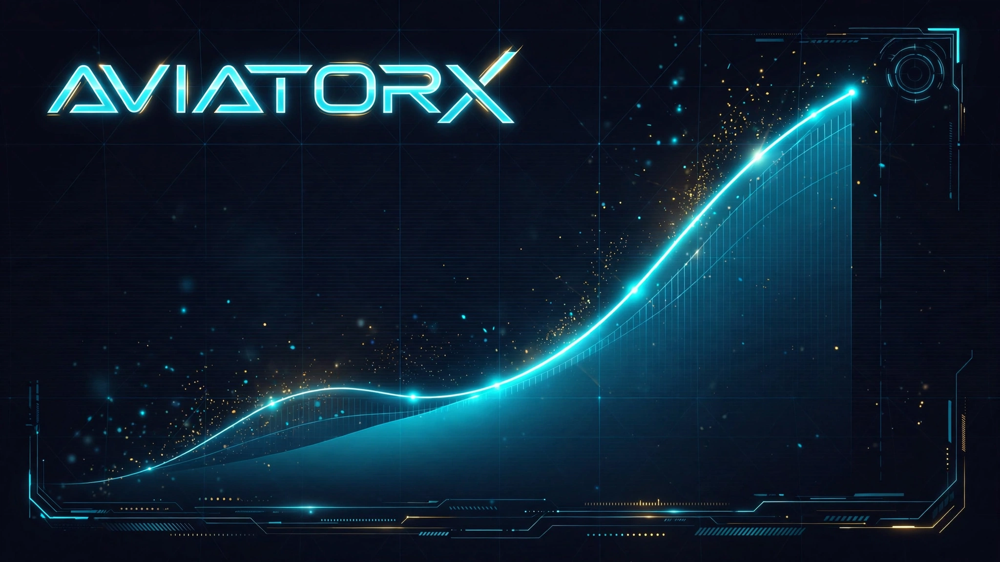

<div align="center">

# ✈️ AviatorX — Signal Intelligence Platform


**A neon-styled front-end demo: a mock "Aviator signal" dashboard with auth, platform selection, signal simulation, and an admin panel — all in a single HTML file.**

</div>

## 🖼️ Preview



## 📌 What is this?

AviatorX is a **UI/UX demo project** — a simulated betting-signal dashboard built with plain HTML, CSS, and JavaScript. It demonstrates how a full multi-page app (landing, auth, dashboard, admin) can live in one file with zero build tools. All signals are randomly generated in the browser for demonstration; nothing here predicts or connects to any real platform.

> ⚠️ **Disclaimer:** Educational/demo purposes only. Not affiliated with any betting platform. All signals are random. Please gamble responsibly.

## ✨ Features

- **Landing page** — hero, stats bar, features grid, platform list, testimonials, FAQ, footer
- **Auth flow** — register (with membership tiers: Free / Premium / VIP) and login, persisted in `localStorage`
- **Dashboard** — 10 platform cards (1xBet, Mostbet, Melbet, Betwinner, BC.Game, Parimatch, Stake, Pin-Up, Linebet, Bet365) with key verification
- **Signal page** — live cashout-target display, confidence meter, countdown timer, signal-validity progress bar, and a history table of the last 20 signals
- **Profile page** — user details, membership badge, signal stats, sign-out
- **Admin panel** (`admin` / `admin123`) — user management (ban/delete), access-key management, platform management, and stats overview
- **Demo keys** — `DEMO2026`, `VIP2026`, `TEST123` work on any platform

## 🛠️ Tech Stack

| Tech | Role |
|---|---|
| HTML5 | Structure (single-file app) |
| CSS3 | Neon cyberpunk styling, animations, responsive layout |
| Vanilla JavaScript | Routing, auth, signal engine, admin logic |
| localStorage | Users, platforms, keys, and session persistence — no backend |

## 🚀 Getting Started

No build step. No dependencies. Just:

1. Clone or download this repo
2. Open `index.html` in any modern browser
3. Register an account (or use admin: `admin` / `admin123`)
4. Enter a demo key (e.g. `DEMO2026`) on any platform card to unlock the signal view

```bash
git clone https://github.com/hussnainahmedd/Project.git
cd Project
# open index.html in your browser
```

## 📂 Project Structure

```
Project/
├── index.html        # The entire app: styles, markup, and logic
└── assets/
    └── hero.webp     # Preview banner
```

## 📝 Notes

- Everything runs client-side; refreshing the page keeps data via `localStorage`.
- Designed mobile-first with a responsive layout down to small screens.

---

<div align="center">

Built by **Hussnain Ahmad** · [github.com/hussnainahmedd](https://github.com/hussnainahmedd)

</div>
